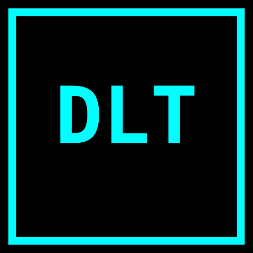

# DLT - Distributed Ledger Technologies

<p align="center">
  
</p>

<p align="center">
  <strong>Enterprise Blockchain Infrastructure</strong><br>
  Building the Future of Digital Finance
</p>

<p align="center">
  <a href="https://distributedledgertechnologies.com">Website</a> •
  <a href="#products">Products</a> •
  <a href="#features">Features</a> •
  <a href="#tech-stack">Tech Stack</a>
</p>

---

## About

Distributed Ledger Technologies (DLT) is a blockchain infrastructure company founded in 2020, providing institutional-grade solutions for governments, defense, and global finance. We build critical infrastructure for the digital asset economy.

### Core Values

- **Integrity** - Unwavering commitment to ethical conduct
- **Service Before Self** - Prioritizing mission and stakeholders
- **Excellence in All We Do** - Relentless pursuit of quality

---

## Products

| Product | Description |
|---------|-------------|
| **MacMetal Miner** | Native Metal GPU Bitcoin miner for Apple Silicon |
| **Echelon** | The Sovereign Cash Protocol for offline digital payments |
| **HydroDollar** | Experimental post-petrodollar tokenomics |
| **Ayedex** | Bitcoin mining pool infrastructure |
| **Cora** | Bitcoin Wallet for the Lightning Network |
| **Knexcoin** | Proof-of-Bandwidth layer 1 blockchain |
| **USDX Stablecoin** | Bitcoin-backed USD stablecoin on KnexCoin L1 — 200%+ BTC collateral, zero fees, sub-second settlement |

---

## Bitcoin-Backed Stablecoins

DLT is building **USDX** — a Bitcoin-backed US dollar stablecoin on the KnexCoin Layer 1 blockchain. Unlike USDT and USDC which depend on bank deposits, USDX is backed by over-collateralized Bitcoin reserves that are transparent, auditable, and immune to bank seizure.

| Stablecoin | Ticker | Backing |
|------------|--------|---------|
| US Dollar | **USDX** | 200%+ BTC collateral |
| Euro | **EURX** | 200%+ BTC collateral |
| British Pound | **GBPX** | 200%+ BTC collateral |
| Colombian Peso | **COPX** | 200%+ BTC collateral |

**Market opportunity**: $300B stablecoin market, 87% bank-backed, virtually zero Bitcoin-backed at scale.

---

## Features

### Website Features

- ⚡ **High Performance** - Optimized loading with minimal dependencies
- 🌐 **Interactive 3D Globe** - Three.js powered visualization with financial nodes
- 📱 **Fully Responsive** - Mobile-first design across all devices
- 🎨 **Cyberpunk Aesthetic** - Dark theme with cyan/green neon accents
- 🔍 **SEO Optimized** - Complete meta tags, Open Graph, Twitter Cards
- 📊 **Analytics Ready** - Google Analytics 4 integration
- 🔒 **Security First** - Modern web security practices

### Technical Features

- Three.js animated backgrounds and globe visualizations
- CSS Grid and Flexbox layouts
- Custom animations and transitions
- Form handling with validation
- Responsive navigation with mobile menu
- Lazy loading for performance

---

## Tech Stack

- **HTML5** - Semantic markup
- **CSS3** - Custom properties, Grid, Flexbox, animations
- **JavaScript** - Vanilla ES6+
- **Three.js** - 3D graphics and WebGL
- **TopoJSON** - Geographic data visualization
- **Google Fonts** - Space Grotesk, Space Mono

---

## Pages

| Page | Description |
|------|-------------|
| `index.html` | Homepage with hero, products, and features |
| `about.html` | Company mission, vision, values with 3D globe |
| `careers.html` | Job listings and application portal |
| `contact.html` | Contact form and company information |
| `sitemap.html` | Site navigation overview |
| `404.html` | Custom error page |

---

## File Structure

```
├── index.html              # Homepage
├── about.html              # About Us page
├── careers.html            # Careers page
├── contact.html            # Contact page
├── sitemap.html            # Sitemap page
├── 404.html                # Error page
├── og-image.png            # Open Graph image (1200x630)
├── twitter-image.png       # Twitter Card image (1200x630)
├── favicon-512.png         # Large favicon
├── favicon-192.png         # Android Chrome favicon
├── favicon-32x32.png       # Standard favicon
├── favicon-16x16.png       # Small favicon
├── apple-touch-icon.png    # iOS home screen icon (180x180)
├── site.webmanifest        # PWA manifest
├── sitemap.xml             # XML sitemap for search engines
├── robots.txt              # Search engine directives
└── fonts/
    └── ethnocentric.otf    # Custom display font
```

---

## Setup

### Local Development

1. Clone the repository:
   ```bash
   git clone https://github.com/SystemThreat/dlt-website.git
   cd dlt-website
   ```

2. Serve locally (any static server):
   ```bash
   # Using Python
   python -m http.server 8000
   
   # Using Node.js
   npx serve
   
   # Using PHP
   php -S localhost:8000
   ```

3. Open `http://localhost:8000` in your browser

### Deployment

The site is static HTML and can be deployed to any hosting provider:

- **GitHub Pages** - Push to `gh-pages` branch
- **Netlify** - Connect repository for auto-deploy
- **Vercel** - Import project for instant deployment
- **AWS S3** - Static website hosting
- **Cloudflare Pages** - Edge deployment

---

## Configuration

### Google Analytics

Analytics tracking is configured with ID `G-CSZ00L6ZXV`. To use your own:

1. Replace the measurement ID in all HTML files:
   ```html
   <script async src="https://www.googletagmanager.com/gtag/js?id=YOUR-ID"></script>
   ```

### Social Media Images

Update Open Graph and Twitter images:

1. Replace `og-image.png` and `twitter-image.png`
2. Recommended dimensions: 1200×630 pixels
3. Update meta tags if URLs change

### Contact Form

The contact form uses [Formspree](https://formspree.io). To configure:

1. Create a Formspree account
2. Update the form action URL in `contact.html`

---

## SEO Checklist

- [x] Meta titles and descriptions
- [x] Open Graph tags (Facebook, LinkedIn)
- [x] Twitter Card tags
- [x] Canonical URLs
- [x] Robots meta tags
- [x] XML Sitemap
- [x] Robots.txt
- [x] Schema.org markup
- [x] Mobile responsive
- [x] Fast loading
- [x] HTTPS ready

---

## Browser Support

| Browser | Support |
|---------|---------|
| Chrome | ✅ Full |
| Firefox | ✅ Full |
| Safari | ✅ Full |
| Edge | ✅ Full |
| Opera | ✅ Full |
| IE 11 | ❌ Not supported |

---

## Performance

- Lighthouse Performance: 90+
- First Contentful Paint: < 1.5s
- Time to Interactive: < 3s
- Cumulative Layout Shift: < 0.1

---

## Contributing

1. Fork the repository
2. Create a feature branch (`git checkout -b feature/amazing-feature`)
3. Commit changes (`git commit -m 'Add amazing feature'`)
4. Push to branch (`git push origin feature/amazing-feature`)
5. Open a Pull Request

---

## License

© 2020-2026 Distributed Ledger Technologies. All rights reserved.

---

## Contact

- **Website**: [distributedledgertechnologies.com](https://distributedledgertechnologies.com)
- **Email**: contact@distributedledgertechnologies.com
- **GitHub**: [@SystemThreat](https://github.com/SystemThreat)

---

<p align="center">
  <sub>Built with 💎 by DLT</sub>
</p>
